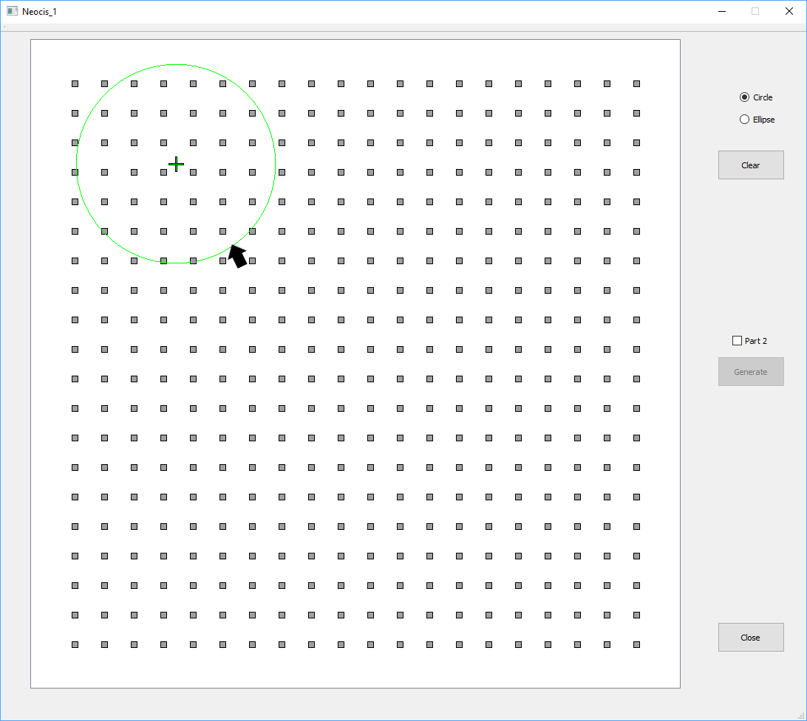
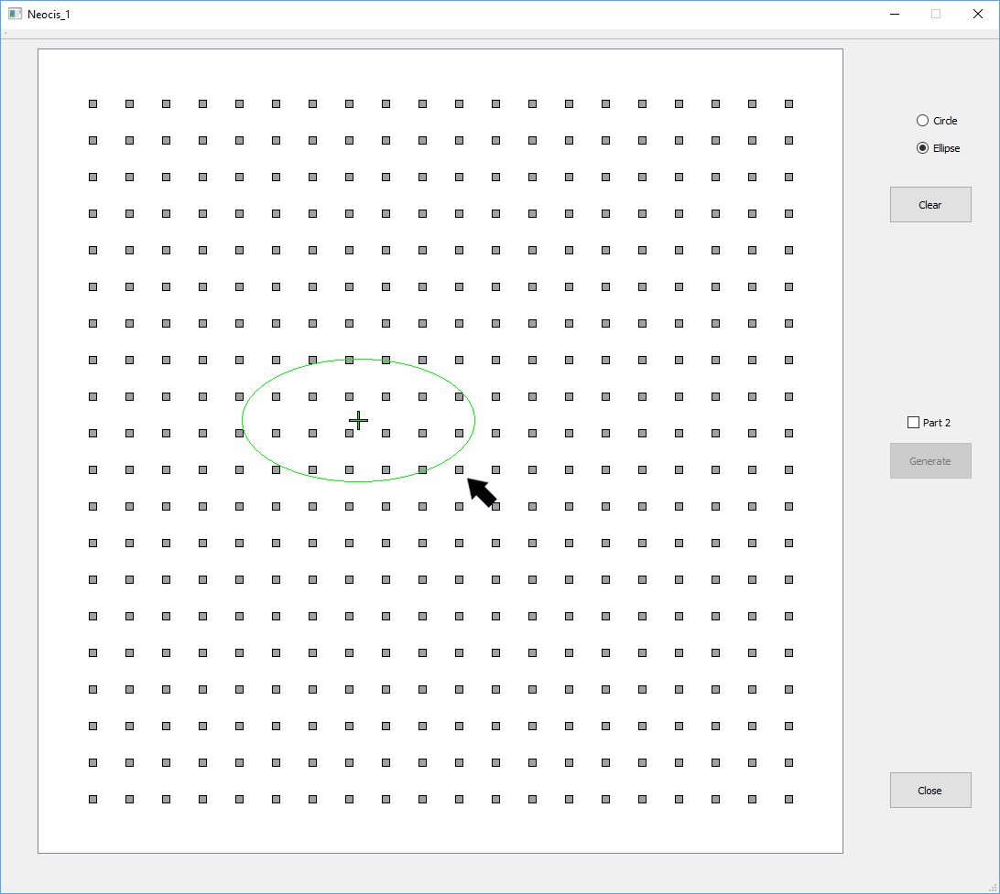

This document provides a user manual, top-level documentation and build instructions for the project.

# User manual
The program may be started from a terminal by running `Neocis_1.exe` in the *\x64\Release* folder, or by double-clicking the icon.  

The initial screen is as follows:   
The initial mode is for _Part 1_; _Part 2_ may be selected by checking the Part 2 check-box.
## Part1
This mode draws circles or ellipses, as selected by the two radio buttons.  In either case, left-click will select the centre of the object.  

For circles, the mouse position represents a point on the circumference of the circle as shown:   

For ellipses, the mouse position represents a corner of the ellipse bounding box.  Note the the ellipse axes are always axis-aligned:  

Releasing the mouse will draw 3 the following:  
1. A circle/ellipse of grid points matching the drawn image
2. A circle/ellipse corresponding to the marked grid point closest to the image centre  
3. A circle/ellipse corresponding to the marked grid point farthest from the image centre  

The following image shows the result of drawing 2 circles and an ellipse:   

The *Clear* button will remove all objects from the screen
## Part 2
In this mode, the user selects points on the grid representing a circle, and clicking *Generate* will create a circle that fits that grid.  An accurate algorithm is used when there are exactly 3 points, and Kasa's algorithm is used otherwise:  this algorithm performs well when there are enough points, but doesn't produce the best fit when the points cover a small portion of an arc.  

The initial screen for this mode is as follows:   

After creating a circle, the *Generate* button is relabeled to *Clear* and will clear the marked points and generated circle.  The following image shows an example:    
# Top-level Documentation
The code has been developed on Visual Studio 2019 and uses Qt 5.12.3.  It should compile and run as is, on Mac and Linux.  
This section will describe two non-trivial algorithms used by the program.  
## Find points corresponding to an ellipse *void Part_1::markSquares()*
The algorithm uses two loops that scan the grid.  The first scans by column, from left to right.  For each column the two (not necessarily unique) grid points that are closest to the ellipse are added to a point set.  The second scan is similar - but scans rows, from top to bottom.  
To understand why a single scan is not enough, consider a near vertical portion of the ellipse.  In this case points on the ellipse with close `x` values have far `y` values.  This would cause many points to be missed.  In other words - the algorithm woul miss the case where multiple close grid points are in the same column.  
The algorithm is fast (O(a + b))  
## Find circle with best fit *bool Part_2::KasaCircleFit()*  
There are a large number of algorithms that compute the best fit of a circle to selected points.  As stated above - an accurate solution is used for the case of 3 points.  For more than 3 points, Kasa's algorithm is used.  Kasa's original paper can be found here [A curve fitting procedure and its error analysis", IEEE Trans. Inst. Meas., Vol. 25, pages 8-14, (1976).](<https://ieeexplore.ieee.org/abstract/document/6312298>).

The code is a slightly modified version of [https://people.cas.uab.edu/~mosya/cl/CircleFitByKasa.cpp](https://people.cas.uab.edu/~mosya/cl/CircleFitByKasa.cpp)  
# Build Instructions
To build on Windows, simply use the provided Visual Studio solution; note that Qt 5.12.3 is required (has not been tested with older versions).  
To create a stand-alone executable, run `windeployqt.exe` in the build folder.  This will copy all required Qt dll's; the program itself is available in *Qt\5.12.3\msvc2017_64\bin*.